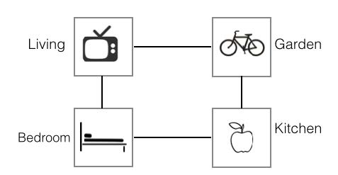
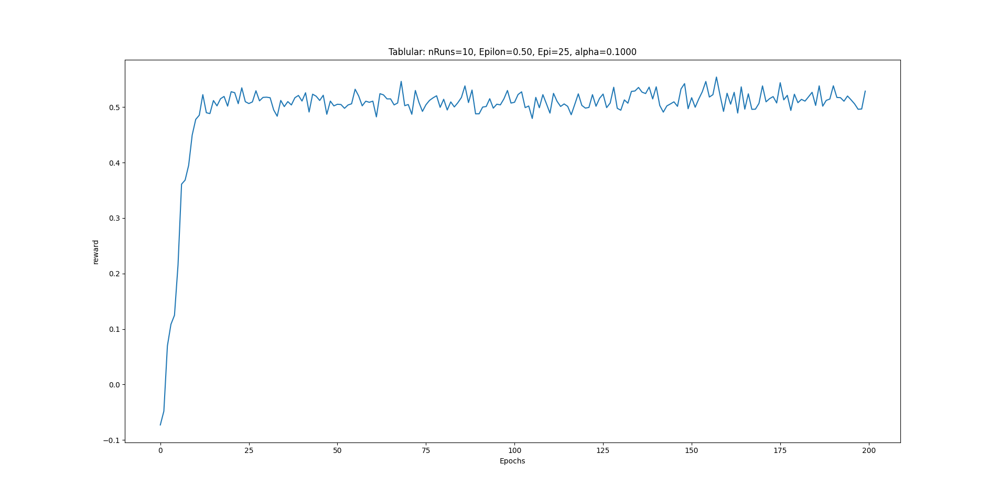
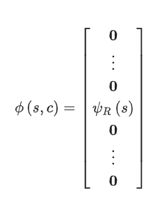
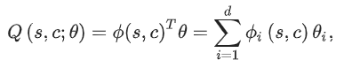
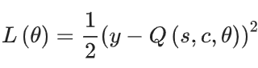
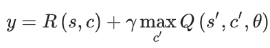

# Reinforcement Liveing

In this project, we address the task of learning control policies for text-based games using reinforcement learning. In these games, all interactions between players and the virtual world are through text. The current world state is described by elaborate text, and the underlying state is not directly observable. Players read descriptions of the state and respond with natural language commands to take actions.

Here, we'll take the following approaches:

1. Implement the tabular Q-learning algorithm for a simple setting where each text description is associated with a unique index.

2. Implement the Q-learning algorithm with linear approximation architecture, using bag-of-words representation for textual state description.

3. Implement a deep Q-network.

4. Use our Q-learning algorithms on the Home World game.

## The Homeworld Game

Below is a schema of the homeworld game environment:



The environment consists of four adjacent places: the living room, the garden, the bedroom and the kitchen. The actions taken by the player are multi-word natural language commands such as eat apple or go east. In this project we are limited to consider commands consisting of one action (e.g., eat) and one argument object (e.g. apple).

The reward structure id illustrated in the following table:

| Positive | Negative |
|:-:|:-:|
| Quest Goal: +1 | Negative per step: -0.01 |
|   | Invalid command: -0.1 |

At the beginning of each episode, the player is placed at a random room and provided with a randomly selected quest. An example of a quest given to the player in text is You are hungry now. To complete this quest, the player has to navigate through the house to reach the kitchen and eat the apple (i.e., type in command eat apple). In this game, the underlying state (room and quest) is hidden from the player, who only receives a description of the underlying room.

Recall that there are four rooms in this game. Assume that there are four quests in this game, each of which would be finished only if the player takes a particular command in a particular room. For example, the quest “You are sleepy" requires the player navigates through rooms to bedroom (with commands such as go east/west/south/north ) and then take a nap on the bed there. For each room, there is a corresponding quest that can be finished there. Note that in this game, the transition between states is deterministic.

In this problem, the expected optimal reward is `0.55375` and the algorithms' reward values must finally converge to this expected optimal value.

## Algorithms

### Tabular Q-learning

In this section, we implementd the Q-learning algorithm, which is a model-free algorithm used to learn an optimal Q-function. In the tabular setting, the algorithm maintains the Q-value for all possible state-action pairs. Starting from a random Q-function, the agent continuously collects experiences and updates its Q-function.

The following figures show the use of various hyperparameter tunings, and whether they converge or not.




### Linear Q-learning

In this section, we get the state's text description to a vector "psi".

And we use feature engineering and map the states/actions to some feature vectors as below:


Then a parameter vector "theta" will maintain the Q-values for us like the following:


Finally, "theta" is updated by taking the gradient step with respect to the following loss function:


Where:


### Deep Q-learning

As seen previously, a linear model is not able to correctly approximate the Q-function for our simple task.

In this section, We will approximate the Q-values with a neural network. We have a DQN that takes the state representation (bag-of-words) and outputs the predicted Q values for the different "actions" and "objects".

We'll use Pytorch for this implementation.

## Run

Make sure you've installed the dependencies of the project:

```
pip3 install -r requirements.txt
```

Run `python3 agent_tabular_ql.py` for the Tabular Q-learning algorithm, `python3 agent_linear.py` for the Linear Q-learning and `python3 agent_dqn.py` for the Deep Q-learning one.
